# 3D 打印耗材库存管理系统

<p align="center">
  
</p>

<p align="center">
  <strong>🌐 中英双语 · 🐳 Docker 容器化 · 🪟 Windows 绿色便携 · 📊 商业报价引擎</strong>
</p>

<p align="center">
  <a href="#-快速开始"></a>
  <a href="#license"></a>
  
  
</p>

---

## 📖 中文

### 项目简介

**3D 打印耗材库存管理系统** 是一款面向 3D 打印爱好者、小型工作室和打印农场的全功能耗材资产管理工具。系统提供耗材全生命周期追踪（从购买、开封、上机使用到耗尽）、多维度统计看板、设备与槽位管理、以及内置的商业成本计算器——帮助用户精确核算每个打印项目的材料成本、设备折旧和利润报价。

系统基于 Flask 构建，采用玻璃拟态（Glassmorphism）深色 UI 主题，支持中英双语无缝切换。提供 **Docker 一键部署** 和 **Windows 绿色便携版** 两种交付形态。

### ✨ 核心功能

#### 📊 仪表板与统计
- **库存总览看板**：总耗材数量、累计购入价值、库存预警、常用耗材标记
- **使用重量追踪**：历史累计消耗与全量剩余净重实时统计
- **低库存预警**：动态阈值告警条，低于设定克数自动提醒
- **厂商耗材统计**：按品牌聚合的耗材数量、材料类型、颜色、总价值
- **交叉状态矩阵**：材料类型 × 5 态（全新/闲置/上机/不足/用尽）交叉统计 + 联动扇形图

#### 🧵 耗材管理
- **全生命周期追踪**：购买日期、价格、渠道、初始重量、当前重量、开封日期
- **5 态状态机**：全新 → 闲置 → 上机 → 不足（动态判定）→ 用尽
- **双轨上机机制**：`is_loaded` 独立布尔字段，与基础状态解耦
- **称重计算器**：秤测总重 − 空盘重量 = 当前净重，自动填入
- **品牌/盘型级联**：品牌下拉 → 盘型下拉 → 自动获取空盘重量
- **实物图管理**：上传/替换/预览，耗材卡片绑定显示
- **批量操作**：批量添加、批量设为闲置/全新、批量删除、批量收藏
- **克隆已有耗材**：快速复制已有耗材配置，减少重复录入

#### 🖨️ 设备管理
- **打印机集群**：多台打印机 + 多槽位（AMS）管理
- **上机/下机**：槽位绑定耗材（自动标记 `is_loaded`）+ 一键解绑
- **耗材使用**：从设备槽位直接记录使用重量，自动扣减
- **打印机型号库**：36 款内置型号（拓竹/创想三维/Prusa 等），含功率/价值/寿命参数
- **一键拥有**：从型号库快速创建设备实例

#### 💰 商业报价引擎
- **成本计算器**：多行耗材 + 多台设备 + 后处理工序动态增行
- **核心定价公式**：`建议报价 = (总成本 + 辛苦费) / (1 − 利润率% − 平台抽成% − 税率%)`
- **分母为零防崩溃**：前置拦截，防止除零导致 502 错误
- **实时看板**：生产总成本、建议报价、纯利润 + Chart.js 饼图
- **历史账单中心**：保存/载入编辑/克隆/删除，支持 50 条历史记录

#### 📝 使用记录与报表
- **使用日志**：每次耗材使用的时间、重量、金额、备注
- **撤回机制**：误操作可撤回，重量自动加回
- **使用图表**：月度趋势折线图 + 每日柱状图 + 累计统计表
- **ROI 效能账单**：代打市场价 vs 自制实际成本对比，月度回本趋势
- **Excel 导出**：7 个工作表全量导出（耗材/材料/记录/打印机/槽位/渠道/品牌）

#### ⚙️ 系统管理
- **外观定制**：卡片透明度、颜色、模糊度实时预览
- **背景图管理**：上传/切换/删除系统背景（默认暗色抽象纹理背景）
- **一键备份**：数据库 + 全部上传文件打包为 ZIP 下载
- **热还原**：上传备份 ZIP，自动覆盖并执行数据库迁移
- **数据迁移**：支持从旧版 `.db` / `.txt` 导入
- **调试模式**：CMD 窗口日志级别可控（日常清爽 / 排错全量）

#### 🌐 国际化 (i18n)
- **624 键中英双语字典**：覆盖全部 UI 文本、提示、图表标签
- **语言切换**：设置页面即时切换，全系统无死角
- **前后端双辅助函数**：Jinja2 `{{ i18n.key }}` + JS `_i('key', 'fallback')`
- **状态枚举防灾**：DB 存中文，UI 显示 i18n，API 校验守卫，三层防御

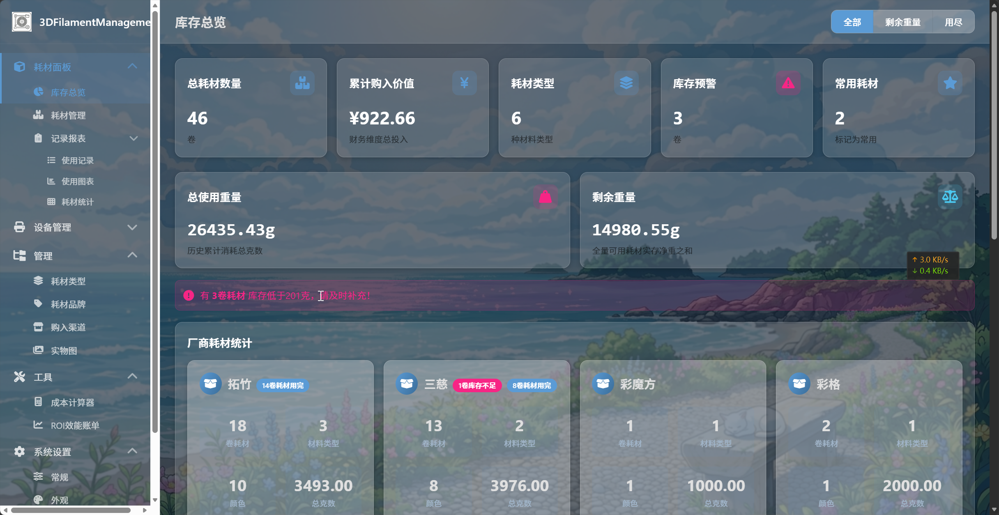

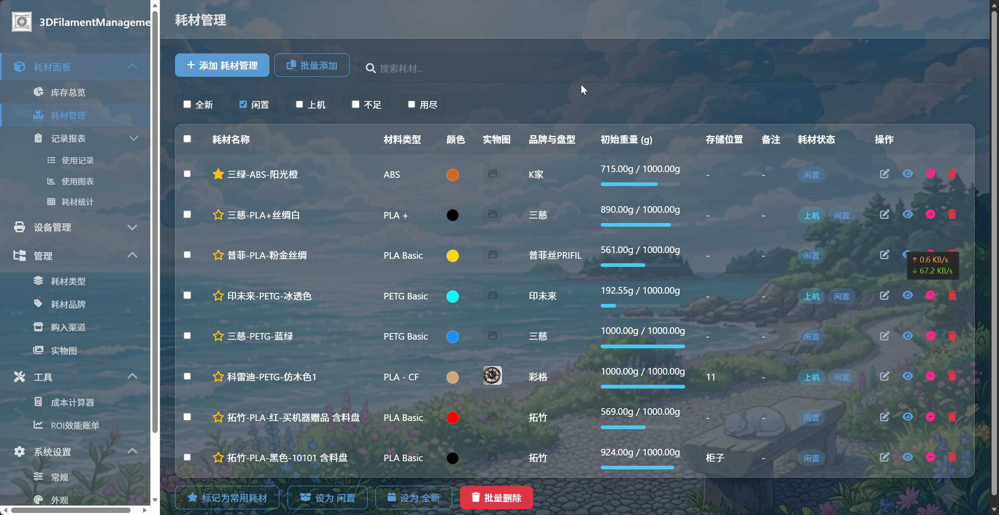

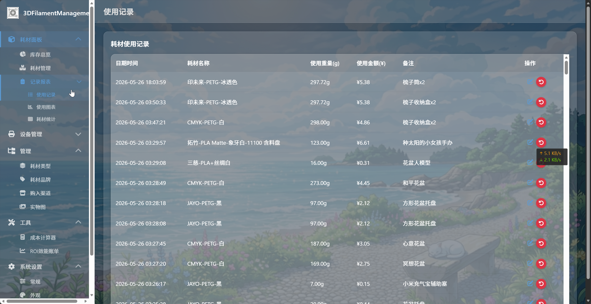

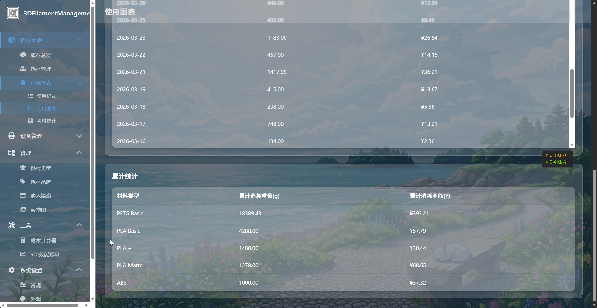

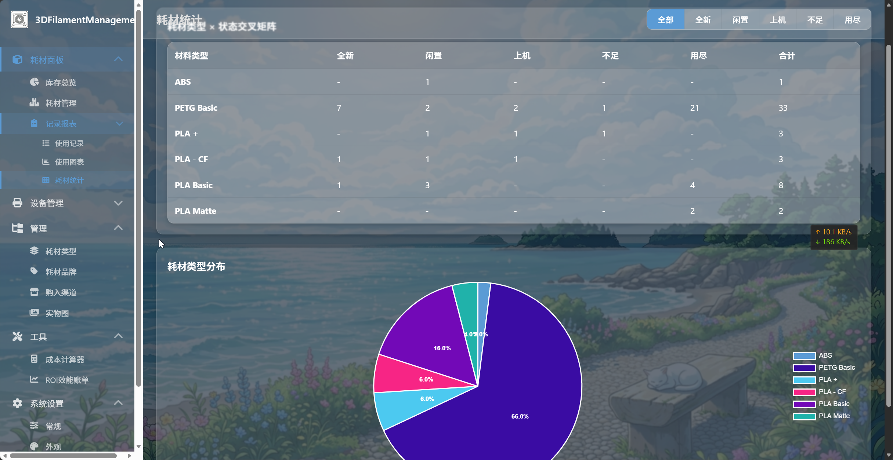

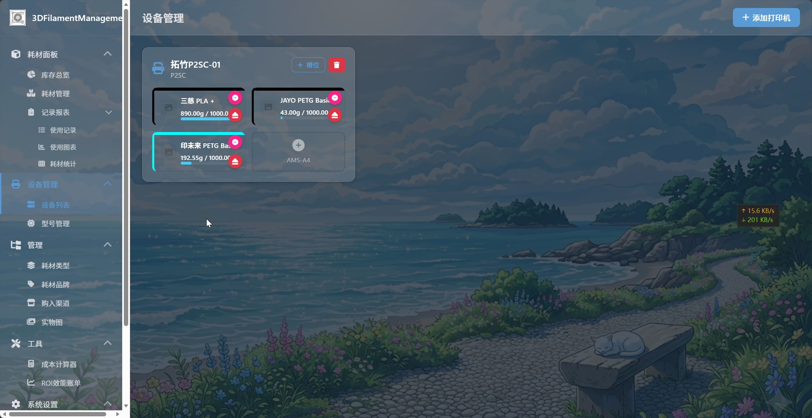

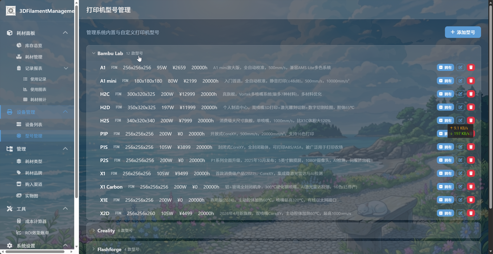

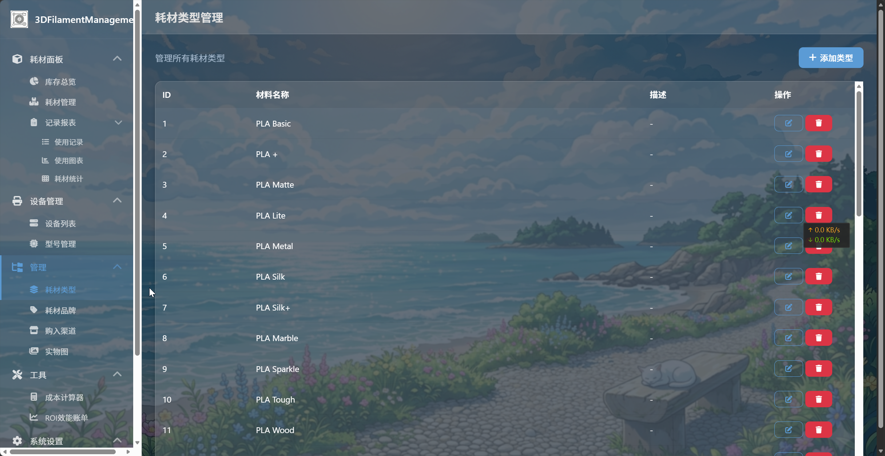

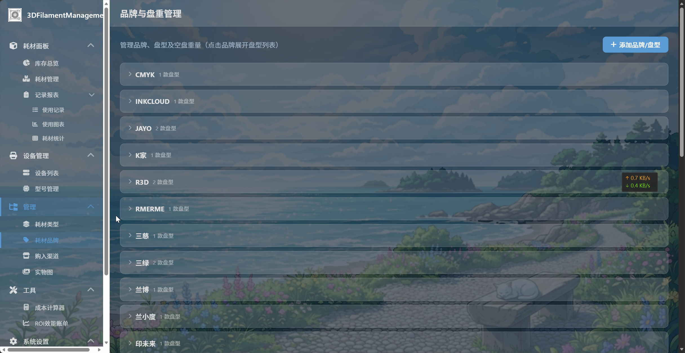

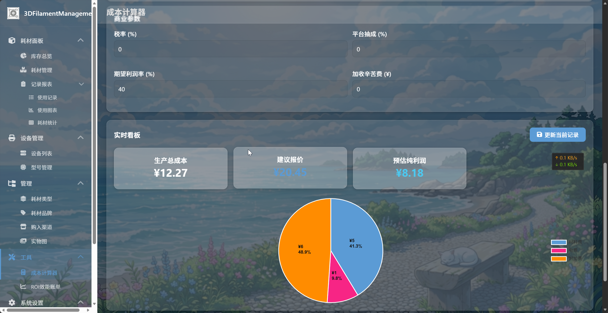

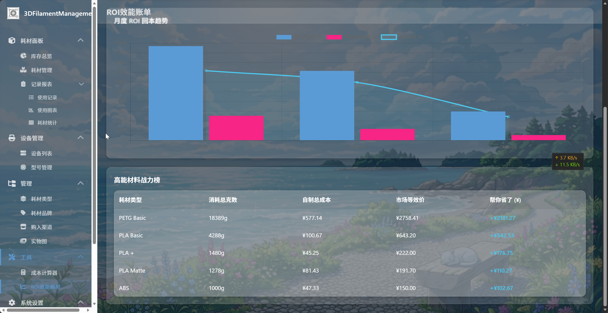

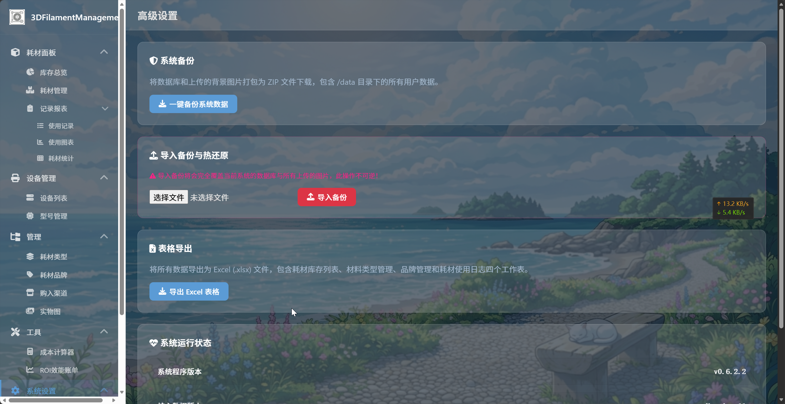

### 🛠️ 技术栈

| 层级 | 技术 |
|------|------|
| 后端 | Python 3 + Flask (Blueprint 模块化架构) |
| 数据库 | SQLite3 (版本化迁移引擎, 11 步增量升级) |
| 前端 | Vanilla JS + Jinja2 模板 + Chart.js |
| UI 主题 | 玻璃拟态 (Glassmorphism) 深色主题 |
| 容器化 | Docker + docker-compose |
| 桌面端 | PyInstaller `--onedir` + 批处理启动脚本 |
| 测试 | E2E 集成测试套件 (24 项) |

### 🚀 快速开始

#### Docker 部署（推荐服务器/NAS）

**Docker Hub:** [pixelpulse01/3dfilamentmanagement](https://hub.docker.com/r/pixelpulse01/3dfilamentmanagement)

##### 方式一：直接拉取镜像

```bash
docker pull pixelpulse01/3dfilamentmanagement:latest

docker run -d \
  --name 3dfilament \
  -p 9055:3155 \
  -v /opt/docker-stacks/3dfilamentmanagement:/data \
  -e SECRET_KEY=your-random-secret-key \
  -e TZ=Asia/Shanghai \
  pixelpulse01/3dfilamentmanagement:latest
```

访问 `http://<你的服务器IP>:9055`

##### 方式二：Docker Compose（推荐）

创建 `docker-compose.yml`：

```yaml
services:
  3dfilamentmanagement:
    image: pixelpulse01/3dfilamentmanagement:latest
    container_name: 3dfilamentmanagement
    restart: unless-stopped
    environment:
      - TZ=Asia/Shanghai
      - SECRET_KEY=change-me-to-random-string
      - DATA_DIR=/data
    ports:
      - "9055:3155"
    volumes:
      - /opt/docker-stacks/3dfilamentmanagement:/data
```

```bash
docker compose up -d
```

##### 配置参数说明

| 参数 | 默认值 | 说明 |
|-----------|---------|-------------|
| `-p 9055:3155` | `9055:3155` | 宿主机端口 : 容器端口（容器内固定监听 3155） |
| `-v ...:/data` | — | 数据持久化卷（数据库 + 上传文件） |
| `SECRET_KEY` | `change-me-to-random-string` | Flask 密钥 — **生产环境请务必修改** |
| `TZ` | `Asia/Shanghai` | 时区（影响 SQLite 时间函数） |
| `DATA_DIR` | `/data` | 容器内数据目录（通常无需修改） |

##### 从源码构建

```bash
git clone https://github.com/pixelpulse0x1/3DFilamentManagement.git
cd 3DFilamentManagement/workspace
docker compose build --no-cache
docker compose up -d
```

#### Windows 绿色便携版（推荐桌面用户）

##### 下载与解压

1. 下载 `3D_Inventory_Management_v0.6.2.2.zip`（约 30MB）
2. 解压到任意目录（如 `D:\3DInventory\` 或桌面）
3. **不需要安装 Python 或任何依赖**，解压即用

##### 解压后的目录结构

```
3D_Inventory_Management_v0.6.2.2/
├── 运行系统.bat                  # ← 双击这个启动
├── static/                       # 前端静态资源 (CSS/JS/背景图)
├── templates/                    # 页面模板
└── backend/                      # 核心引擎
    ├── server.exe                # 编译好的主程序
    └── _internal/                # Python 运行时与依赖库
```

首次运行后会自动创建 `data/` 目录：

```
data/                             # 【自动创建】所有数据都在这里
├── database/
│   └── filament_inventory.db     # SQLite 数据库
└── uploads/
    ├── backgrounds/              # 背景图（含默认 Background.png）
    └── filaments/                # 耗材实物图
```

##### 启动与使用

1. **双击 `运行系统.bat`** — 弹出黑色运维看板窗口
2. 浏览器自动打开 `http://127.0.0.1:9055`
3. 开始使用系统
4. **关闭 CMD 窗口** 或按 `Ctrl+C` 即可安全退出

> **数据完全便携**：所有数据库、上传图片均存储在解压目录的 `data/` 文件夹内。如需迁移到另一台电脑，直接将整个文件夹复制过去即可，数据不会丢失。

##### 调试模式说明

启动脚本头部有一行：

```batch
set DEBUG_MODE=false
```

- **`false`（默认）**：控制台仅显示错误/警告，日常使用时窗口清爽安静
- **`true`**：恢复全量 HTTP 请求日志滚动输出，用于排查问题

修改后重新双击 `运行系统.bat` 生效。

##### 从源码自行编译

如果想自行编译，可在项目目录下运行 `Windows一键编译exe程序.bat`，自动完成虚拟环境创建 → 依赖安装 → PyInstaller 编译 → 发布包组装全流程。详见 [TECHNICAL_REFERENCE.md §9.3](TECHNICAL_REFERENCE.md)。

#### 开发环境

```bash
cd workspace
pip install -r requirements.txt
python app.py
# 访问 http://127.0.0.1:9055
```

### 📁 项目结构

```
workspace/
├── app.py                       # 应用入口（多环境自适应路径 + 日志引擎）
├── modules/                     # Flask Blueprint 模块
│   ├── db.py                    # 数据库层（版本化迁移引擎, V1→V11）
│   ├── i18n.py                  # 中英双语字典 (624 键)
│   ├── base/                    # 基础路由、设置、背景管理、备份、旧数据导入
│   ├── filaments/               # 耗材 CRUD、使用记录、统计、交叉矩阵
│   ├── materials/               # 材料类型管理
│   ├── brands/                  # 品牌与盘重管理
│   ├── channels/                # 购买渠道管理
│   ├── images/                  # 实物图管理
│   ├── printers/                # 打印机、槽位、上机/下机、型号库
│   └── tools/                   # 成本计算器与历史记录
├── static/
│   ├── css/                     # 玻璃拟态主题样式 + 响应式
│   └── js/                      # 前端业务逻辑 (10 个模块)
├── templates/                   # Jinja2 模板 (18 个页面/组件)
├── 运行系统.bat                  # Windows 便携版启动脚本
├── Windows一键编译exe程序.bat     # Windows 一键编译打包工具
├── docker-compose.yml           # Docker 编排
├── Dockerfile                   # Docker 镜像构建
├── entrypoint.sh                # 容器入口脚本
├── test_suite.py                # E2E 集成测试套件 (24 项)
├── requirements.txt             # Python 依赖
└── TECHNICAL_REFERENCE.md       # 完整技术参考文档
```

### 📖 文档

- [TECHNICAL_REFERENCE.md](TECHNICAL_REFERENCE.md) — 完整技术参考（数据库结构 · API 文档 · 迁移引擎 · 报价公式 · 打包编译 · 部署指南）


### 📄 License

MIT License. 详见 [LICENSE](LICENSE) 文件。

---

## 📖 English

### Overview

**3D Filament Inventory Management System** is a full-featured consumable asset management tool designed for 3D printing enthusiasts, small studios, and print farms. It provides full lifecycle tracking of filaments (from purchase, opening, loading onto printers, to depletion), multi-dimensional statistics dashboards, device & slot management, and a built-in commercial cost calculator — helping users accurately calculate material costs, equipment depreciation, and profit pricing for each print project.

Built on Flask with a Glassmorphism dark UI theme, the system supports seamless Chinese/English bilingual switching. Available in two deployment forms: **Docker one-click deployment** and **Windows portable edition**.

### ✨ Key Features

#### 📊 Dashboard & Statistics
- **Inventory Overview**: Total filament count, cumulative purchase value, low-stock alerts, favorites
- **Weight Tracking**: Historical total consumption + remaining net weight (real-time)
- **Low Stock Alert**: Dynamic threshold warning bar, auto-alert when below configured grams
- **Manufacturer Stats**: Per-brand aggregation of filament count, material types, colors, total value
- **Cross Status Matrix**: Material Type × 5-state (New/Idle/Loaded/Low/Depleted) with linked donut chart

#### 🧵 Filament Management
- **Full Lifecycle**: Purchase date/price/channel, initial weight, current weight, opened date
- **5-State Machine**: New → Idle → Loaded → Low (dynamic) → Depleted
- **Dual-Track Loading**: `is_loaded` independent boolean, decoupled from base status
- **Weighing Calculator**: Gross weight − Spool weight = Net weight, auto-fill
- **Brand/Spool Cascade**: Brand dropdown → Spool dropdown → auto-fetch spool weight
- **Image Management**: Upload/replace/preview filament images
- **Batch Operations**: Batch add, batch set status, batch delete, batch favorite
- **Clone Filament**: Quick-copy existing filament config to reduce repeat entry

#### 🖨️ Device Management
- **Printer Fleet**: Multiple printers + multiple slots (AMS) management
- **Load/Unload**: Slot-filament binding (auto-mark `is_loaded`) + one-click unbind
- **Filament Usage**: Record usage weight directly from device slot, auto-deduct
- **Printer Model Library**: 36 built-in models (Bambu Lab/Creality/Prusa etc.), with power/value/lifespan specs
- **Quick Own**: One-click create printer instance from model library

#### 💰 Commercial Pricing Engine
- **Cost Calculator**: Dynamic multi-row filaments + printers + post-processing
- **Core Formula**: `Suggested Price = (Total Cost + Labor) / (1 − Profit% − Platform% − Tax%)`
- **Zero-Denominator Protection**: Pre-guard prevents division-by-zero (502 errors)
- **Live Dashboard**: Total cost, suggested price, pure profit + Chart.js pie chart
- **History Center**: Save / Load & Edit / Clone / Delete, up to 50 records

#### 📝 Usage Records & Reports
- **Usage Logs**: Time, weight, cost, remark for each filament usage
- **Withdraw Mechanism**: Undo mistaken usage, weight auto-restored
- **Usage Charts**: Monthly trend line + daily bar chart + cumulative stats table
- **ROI Billing**: Market price vs actual DIY cost comparison, monthly ROI trend
- **Excel Export**: 7-sheet comprehensive export (filaments/materials/records/printers/slots/channels/brands)

#### ⚙️ System Management
- **Appearance**: Real-time preview of card opacity, color, blur
- **Background**: Upload/switch/delete system backgrounds (dark abstract texture default)
- **One-Click Backup**: Database + all uploaded files packaged as ZIP download
- **Hot Restore**: Upload backup ZIP, auto-overwrite + run DB migrations
- **Data Migration**: Import from legacy `.db` / `.txt` files
- **Debug Mode**: Console log level controllable (clean daily use / verbose troubleshooting)

#### 🌐 Internationalization (i18n)
- **624-Key Bilingual Dictionary**: Covers all UI text, prompts, chart labels
- **Language Switch**: Instant toggle on settings page, zero dead spots
- **Dual Helper Functions**: Jinja2 `{{ i18n.key }}` + JS `_i('key', 'fallback')`
- **Status Enum Disaster Prevention**: DB stores Chinese, UI displays i18n, API validates — triple-layer defense

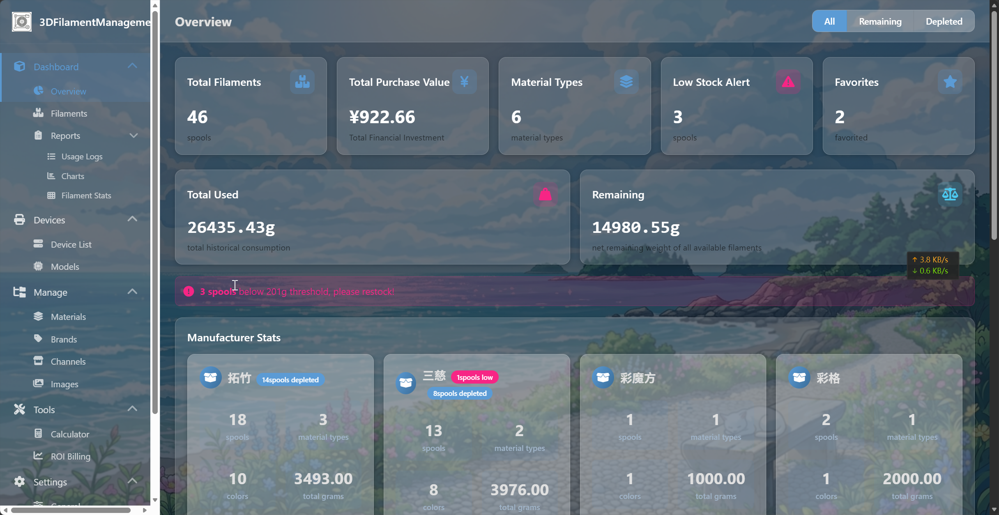


### 🛠️ Tech Stack

| Layer | Technology |
|-------|------------|
| Backend | Python 3 + Flask (Blueprint modular architecture) |
| Database | SQLite3 (versioned migration engine, 11-step incremental) |
| Frontend | Vanilla JS + Jinja2 templates + Chart.js |
| UI Theme | Glassmorphism dark theme |
| Container | Docker + docker-compose |
| Desktop | PyInstaller `--onedir` + batch launcher |
| Testing | E2E integration test suite (24 cases) |

### 🚀 Quick Start

#### Docker (Recommended for Server/NAS)

**Docker Hub:** [pixelpulse01/3dfilamentmanagement](https://hub.docker.com/r/pixelpulse01/3dfilamentmanagement)

##### Option 1: Pull from Docker Hub

```bash
docker pull pixelpulse01/3dfilamentmanagement:latest

docker run -d \
  --name 3dfilament \
  -p 9055:3155 \
  -v /opt/docker-stacks/3dfilamentmanagement:/data \
  -e SECRET_KEY=your-random-secret-key \
  -e TZ=Asia/Shanghai \
  pixelpulse01/3dfilamentmanagement:latest
```

Then visit `http://<your-server-ip>:9055`

##### Option 2: Docker Compose (Recommended)

Create a `docker-compose.yml`:

```yaml
services:
  3dfilamentmanagement:
    image: pixelpulse01/3dfilamentmanagement:latest
    container_name: 3dfilamentmanagement
    restart: unless-stopped
    environment:
      - TZ=Asia/Shanghai
      - SECRET_KEY=change-me-to-random-string
      - DATA_DIR=/data
    ports:
      - "9055:3155"
    volumes:
      - /opt/docker-stacks/3dfilamentmanagement:/data
```

```bash
docker compose up -d
```

##### Configuration

| Parameter | Default | Description |
|-----------|---------|-------------|
| `-p 9055:3155` | `9055:3155` | Host port : Container port (container listens on 3155) |
| `-v ...:/data` | — | Persistent data volume (database + uploads) |
| `SECRET_KEY` | `change-me-to-random-string` | Flask secret key — **change in production** |
| `TZ` | `Asia/Shanghai` | Timezone (affects SQLite datetime functions) |
| `DATA_DIR` | `/data` | Data directory inside container (usually leave as default) |

##### Build from Source

```bash
git clone https://github.com/pixelpulse0x1/3DFilamentManagement.git
cd 3DFilamentManagement/workspace
docker compose build --no-cache
docker compose up -d
```

#### Windows Portable (Recommended for Desktop)

##### Download & Extract

1. Download `3D_Inventory_Management_v0.6.2.2.zip` (~30 MB)
2. Extract to any folder (e.g. `D:\3DInventory\` or Desktop)
3. **No Python or dependencies required** — ready to run

##### Extracted Structure

```
3D_Inventory_Management_v0.6.2.2/
├── 运行系统.bat                  # ← Double-click to launch
├── static/                       # Frontend assets (CSS/JS/backgrounds)
├── templates/                    # Page templates
└── backend/                      # Core engine
    ├── server.exe                # Compiled main executable
    └── _internal/                # Python runtime & dependency libraries
```

On first run, a `data/` directory is auto-created:

```
data/                             # [Auto-created] All data lives here
├── database/
│   └── filament_inventory.db     # SQLite database
└── uploads/
    ├── backgrounds/              # Background images (incl. default Background.png)
    └── filaments/                # Filament photos
```

##### Launch & Use

1. **Double-click `运行系统.bat`** — a black console window opens
2. Browser auto-opens `http://127.0.0.1:9055`
3. Start using the system
4. **Close the CMD window** or press `Ctrl+C` to safely exit

> **Fully Portable**: All data (database, uploads) resides in the `data/` folder. To migrate to another PC, simply copy the entire folder — data will not be lost.

##### Debug Mode

At the top of the launcher script:

```batch
set DEBUG_MODE=false
```

- **`false` (default)**: Console shows only errors/warnings — clean and quiet for daily use
- **`true`**: Full HTTP request logs scroll in the console — useful for troubleshooting

Change the value and relaunch `运行系统.bat` for it to take effect.

##### Build from Source

To compile your own build, run `Windows一键编译exe程序.bat` in the project directory. It automates the full pipeline: venv → deps → PyInstaller → flatten → assemble. See [TECHNICAL_REFERENCE.md §9.3](TECHNICAL_REFERENCE.md) for details.

#### Development

```bash
cd workspace
pip install -r requirements.txt
python app.py
# Visit http://127.0.0.1:9055
```

### 📁 Project Structure

```
workspace/
├── app.py                       # App factory (multi-env adaptive paths + log engine)
├── modules/                     # Flask Blueprint modules
│   ├── db.py                    # Versioned migration engine (V1→V11)
│   ├── i18n.py                  # Bilingual dictionary (624 keys)
│   ├── base/                    # Core routes, settings, backgrounds, backup, migration
│   ├── filaments/               # Filament CRUD, usage records, stats, matrix
│   ├── materials/               # Material type management
│   ├── brands/                  # Brand & spool management
│   ├── channels/                # Purchase channel management
│   ├── images/                  # Filament image management
│   ├── printers/                # Printers, slots, load/unload, model library
│   └── tools/                   # Cost calculator & history
├── static/
│   ├── css/                     # Glassmorphism theme + responsive
│   └── js/                      # Frontend logic (10 modules)
├── templates/                   # Jinja2 templates (18 pages/components)
├── 运行系统.bat                  # Windows portable launcher
├── Windows一键编译exe程序.bat     # Windows one-click build tool
├── docker-compose.yml           # Docker Compose config
├── Dockerfile                   # Docker image build
├── entrypoint.sh                # Container entrypoint
├── test_suite.py                # E2E test suite (24 cases)
├── requirements.txt             # Python dependencies
└── TECHNICAL_REFERENCE.md       # Full technical reference
```

### 📖 Documentation

- [TECHNICAL_REFERENCE.md](TECHNICAL_REFERENCE.md) — Complete technical reference (DB schema · API docs · migration engine · pricing formulas · build & packaging · deployment guide) — *in Chinese*

### 📄 License

MIT License. See [LICENSE](LICENSE) file.

---

<p align="center">
  <sub>Built with ❤️ by <a href="https://github.com/pixelpulse0x1">pixelpulse0x1</a></sub>
</p>
